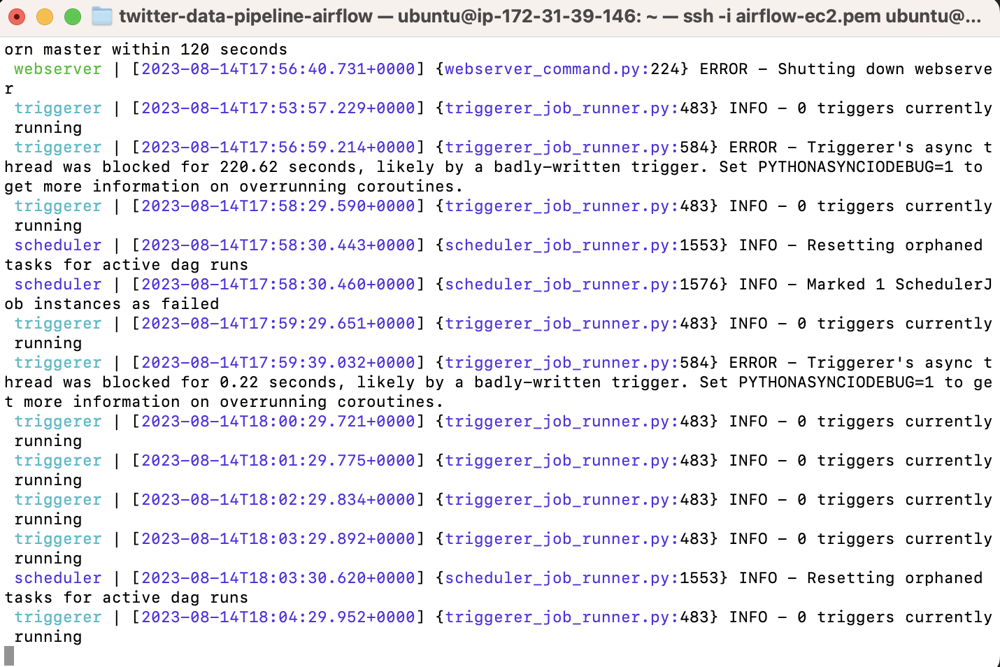
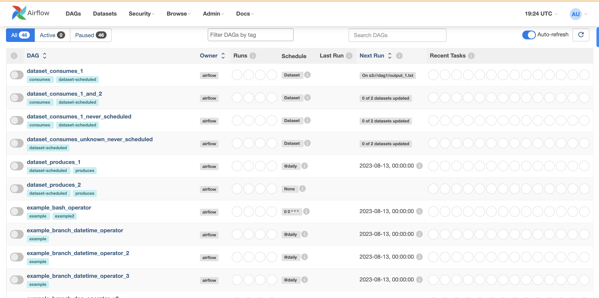
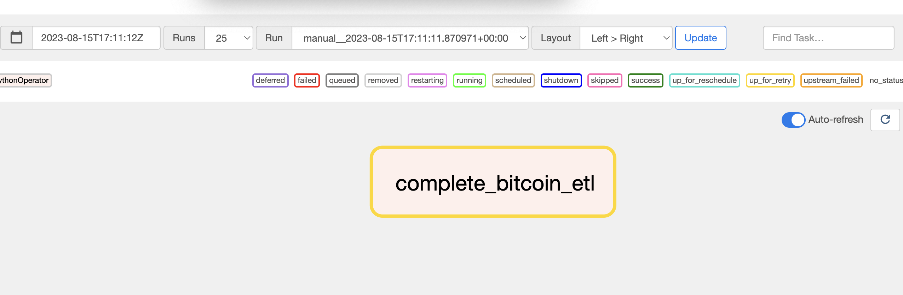

# Creating Data Pipeline for automatic data retrieval and cleaning using Airflow

In this project, we fetched wrote and deployed airflow pipeline on Ec2 instance on AWS to automate the process of fetching and cleaning bitcoin data. We also store the fetched data to S3 bucket on AWS.

This involved - 
1. Starting AWS Instance, Installing Apache Airflow  on the AWS Instance

2. Creating Airflow dag code for the bitcoin data pipeline. 

3. Deploying the airflow python code to Ec2 AWS and running and checking the pipeline.

